### Engenheira de Software | Desenvolvedora Full Stack

  
  
  

 
*"I don't accept superficial explanations - I seek the logic behind every technical decision."*

---

## 🎯 Sobre mim

  

Sou **estudante de Engenharia de Software** na PUC Minas e atuo como **estagiária em desenvolvimento web** na [LexisNexis Risk Solutions](https://www.lexisnexis.com/). Construo aplicações estáveis e bem estruturadas com foco em qualidade.

<table>
<tr>
<td width="50%" valign="top">
  
• Entendo o **porquê** das tecnologias, não apenas o "como"  
• Estudo constantemente: sistemas, produção, segurança e boas práticas  

</td>
<td width="50%" valign="top">

• Perfil analítico - busco a lógica por trás de cada decisão técnica  
• Valorizo processos, comunicação e organização  

</td>
</tr>
</table>

---

## 📊 GitHub em números

<table>
  <tr>
    <td></td>
    <td></td>
  </tr>
</table>

---

## 🛠️ Tech Stack

**Backend**
 

**Frontend**
 

**Banco de Dados & Ferramentas**
 

---

## 🐍 Contribuições

<picture>
  <source media="(prefers-color-scheme: dark)" srcset="./profile/snake-dark.svg">
  <source media="(prefers-color-scheme: light)" srcset="./profile/snake.svg">
  
</picture>

---

## 📚 Livros que recomendo

<table>
<tr>
<th align="center">📖 Livro</th>
<th align="center">✍️ Autor</th>
<th align="center">💡 Por quê?</th>
</tr>
<tr>
<td><a href="https://www.amazon.com.br/Código-limpo-Robert-C-Martin/dp/8576082675"><b>Clean Code</b></a></td>
<td>Robert C. Martin</td>
<td>Código legível e manutenível</td>
</tr>
<tr>
<td><a href="https://pragprog.com/titles/tpp20/the-pragmatic-programmer-20th-anniversary-edition/"><b>The Pragmatic Programmer</b></a></td>
<td>Hunt & Thomas</td>
<td>Dicas práticas essenciais</td>
</tr>
<tr>
<td><a href="https://dataintensive.net/"><b>Designing Data-Intensive Applications</b></a></td>
<td>Martin Kleppmann</td>
<td>Sistemas distribuídos na prática</td>
</tr>
<tr>
<td><a href="https://refactoring.com/"><b>Refactoring</b></a></td>
<td>Martin Fowler</td>
<td>Melhorar código sem quebrá-lo</td>
</tr>
<tr>
<td><a href="https://github.com/getify/You-Dont-Know-JS"><b>You Don't Know JS</b></a></td>
<td>Kyle Simpson</td>
<td>JavaScript a fundo (open source!)</td>
</tr>
</table>

---

## 🎬 Filmes e séries sobre tech

<table>
<tr>
<th>🎞️ Título</th>
<th>📺 Onde assistir</th>
<th>🔥 Por quê?</th>
</tr>
<tr>
<td><b>Mr. Robot</b></td>
<td>Prime Video</td>
<td>Hacking, cybersecurity e crítica social</td>
</tr>
<tr>
<td><b>Silicon Valley</b></td>
<td>HBO Max</td>
<td>Comédia sobre startups (muito real)</td>
</tr>
<tr>
<td><b>The Social Network</b></td>
<td>Netflix, Prime</td>
<td>Origem do Facebook e cultura de startups</td>
</tr>
<tr>
<td><b>Ex Machina</b></td>
<td>Netflix, Prime</td>
<td>IA, ética e inteligência artificial</td>
</tr>
<tr>
<td><b>Black Mirror</b></td>
<td>Netflix</td>
<td>Futuro da tecnologia e sociedade</td>
</tr>
<tr>
<td><b>Halt and Catch Fire</b></td>
<td>Netflix</td>
<td>Pioneiros da revolução digital</td>
</tr>
<tr>
<td><b>The Imitation Game</b></td>
<td>Netflix</td>
<td>Alan Turing e a origem da computação</td>
</tr>
<tr>
<td><b>Startup</b></td>
<td>Netflix</td>
<td>Criptomoedas, hackers e empreendedorismo</td>
</tr>
</table>

<i>💡 Assistir é bom - codar é melhor!</i>

---

## 🏆 Premiações

| 🥇 | **Destaque do Semestre** | Conexa Saúde (CSC) | Ago 2023 |
|----|--------------------------|-------------------|----------|
| 🥇 | **Destaque do Trimestre** | Conexa Saúde (Financeiro) | Set 2023 |

---

## 💼 Experiência

<table>
<tr>
<td width="50%">

**LexisNexis Risk Solutions**  
*Estágio em Desenvolvimento Web • 2024 – presente*

• Full stack com Vue.js e PHP  
• Ciclo completo: features, segurança, deploy, CI/CD  
• Colaboração com engenheiros e QA  

</td>
<td width="50%">

**Conexa Saúde**  
*Assistente Financeira → Planejamento e Processos*

• Automação com Python e sistemas web  
• Redução de tempo operacional  
• Foco em eficiência e processos  

</td>
</tr>
</table>

---

## 📌 Projetos em destaque

<table>
<tr>
<td>

**[CasaDosDiscipulos](https://github.com/jrcfxx/CasaDosDiscipulos)**  
Sistema de gestão com módulos gamificados, quizzes e administração completa.

</td>
</tr>
<tr>
<td>

**[Sistema Hackathon](https://github.com/jrcfxx/Sistema-Gerenciamento-Hackathon-Universitario)**  
Gerenciamento de projetos e equipes em hackathons universitários.

</td>
</tr>
<tr>
<td>

**Automação de Faturamento**  
Automação de workflows manuais com Python na Conexa Saúde.

</td>
</tr>
</table>

---

## 🌐 Idiomas

🇧🇷 **Português** - Nativo  
🇺🇸 **Inglês** - Avançado (ICBEU)

---

### 👀 Recrutadores: estou aberta a novas oportunidades!

  
  

